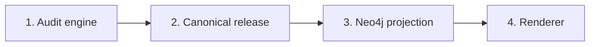

# Four-Layer Formalization

## 1. Authority flow

The Seven Governors Network is formalized as four layers with one-way
authority:



The lower layer may project or display an upstream fact, but it may not invent
or overwrite one.

## 2. Layer 1 — Audit engine

### Responsibility

- enumerate all rooted weight-seven masks;
- compute pitch sets, Hamming distances, fixed-tonic mutations, root-phase
  operations, modal orbits, chirality, and contact signatures;
- test A and D qualification rules;
- emit proof ledgers and invariant results.

### Inputs

- frozen earlier-tier snapshot;
- declared tier rule;
- framework correspondence sources;
- naming metadata, which is non-authoritative for topology.

### Outputs

- computed state and relation facts;
- audit reports;
- validation ledgers;
- provenance.

### Guard

The audit engine cannot assign an office merely because a state is visually
near an office or has arbitrary graph reachability.

## 3. Layer 2 — Canonical release

### Responsibility

- apply the declared precedence sequence;
- select governing parents;
- distinguish categorical office from relational-office evidence;
- classify every state as anchor, satellite, or typed boundary;
- preserve stable identifiers and provenance;
- publish one immutable, versioned machine snapshot.

### Canonical source

```text
data/seven-governors-a0-a2-d1-d7-universal-network-data.json
```

### Guard

An earlier assignment cannot be silently overwritten. A changed invariant or
office rule requires a new protocol version and decision record.

## 4. Layer 3 — Neo4j projection

### Responsibility

- expose canonical states as `ScaleState` nodes;
- expose `ScaleFamily` and `GovernorOffice` projection nodes;
- preserve typed harmonic and evidentiary relationships;
- project categorical offices with `OCCUPIES_OFFICE`;
- project non-categorical office vectors with
  `RELATIONAL_OFFICE_EVIDENCE`;
- enforce identity constraints and execute invariant queries.

### Rebuild policy

Neo4j is a reproducible materialized projection of the canonical release. It
may be dropped and rebuilt. Manual database edits must not become audit facts.

### Guard

`RELATIONAL_OFFICE_EVIDENCE` never implies `OCCUPIES_OFFICE`. Any proposed
promotion must return to Layers 1 and 2 for a new declared rule and audit.

## 5. Layer 4 — Renderer

### Responsibility

- arrange Governor offices Sun through Saturn;
- distinguish A and D anchors, satellites, and boundary roles;
- expose relation filters and selected-state evidence;
- render fixed-tonic and root-phase channels distinctly.

### Guard

Coordinates and lane placement are presentation metadata. A boundary node may
be placed near the office supported by relational evidence without acquiring a
categorical office.

> Semantics determine placement; placement never determines semantics.

## 6. End-to-end release sequence

1. Run the universal audit builder.
2. Run the independent mathematical validator.
3. freeze the canonical JSON and ledgers;
4. export the Neo4j CSV projection;
5. run the offline Neo4j-export validator;
6. import the CSV files into Neo4j;
7. run `neo4j/validation.cypher`;
8. rebuild the interactive graph from canonical or Neo4j data;
9. validate the graph counts and interactions; and
10. generate the manifest and checksums.

## 7. Change classes

| Change | Owning layer | Required response |
|---|---|---|
| Correct a Hamming or phase calculation | Audit engine | Rebuild every downstream layer |
| Admit a new anchor rule | Audit engine + canonical release | New protocol version and full audit |
| Add a query index | Neo4j | No topology change |
| Add relational-office evidence projection | Canonical release + Neo4j | Preserve categorical-office guard |
| Move nodes or change colors | Renderer | No topology change |
| Assign an office from screen position | Prohibited | Reject the change |

## 8. Reproducibility contract

A consumer can reconstruct the system without external naming catalogues by
using:

- the frozen source snapshot;
- the audit scripts;
- the canonical universal JSON;
- the Neo4j export script and CSV projection;
- the Cypher schema, importer, and validation suite; and
- the packaged network renderer source.

Names may be enriched later. IDs, masks, relations, offices, roles, and proof
signatures remain independently reproducible.

