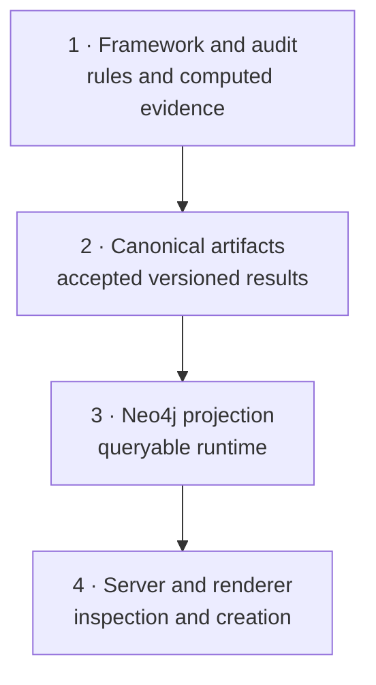

# Start Here

## What is installed

The active system is best described as a **typed structural algebra and
semantic profile compiler over a versioned property graph**.

- The topology supplies state identity and legal structural relations.
- The mutation audit supplies total and partial structural operators.
- Governor profiles supply admitted office semantics and physical anchors.
- Normalization separates destination identity from route history.
- The active landform projection compiles creation constraints.
- Neo4j projects those versioned artifacts for the server and queries.

This is more precise than calling the system only an ontology or database.
Those descriptions are incomplete, while global lattice language remains
unproved and is therefore reserved.

The Fivefold controller, Mercury/Virgo ledger, and natural-phenomenon mappings
described by this companion are candidate extensions. They are not active
runtime layers, graph projections, or creation-packet fields in the installed
release.

## The four formal layers

The profile registry follows the same one-way direction: frozen authoring
inputs are compiled into versioned canonical data, projected into Neo4j, and
consumed by the server. Downstream layers cannot rewrite an upstream fact.
Candidate material in this package enters that flow only after an explicit
admission decision and a rebuilt release.

## The three most useful questions

When inspecting any property or relationship, ask:

1. **What kind of claim is this?** Physical, formal, authored semantic,
   observed hypothesis, or generative output?
2. **What owns it?** Framework source, canonical artifact, mutation audit,
   profile registry/compiler, runtime projection, or candidate package?
3. **What could falsify or revise it?** A failed invariant, a new canon
   decision, a compiler defect, or accumulated observations?

Those questions prevent an evocative correspondence from being mistaken for a
physical proof, and prevent graph proximity from becoming an office
assignment.

## Recommended learning path

| Read | You will learn |
|---|---|
| `ENTITY_AND_ALGEBRA_API.md` | What each entity, role, relation, and algebraic word means |
| `INVARIANT_CATALOG.md` | What must remain true for the topology to stay valid |
| `FIVEFOLD_ENGINE_AND_THERMODYNAMICS.md` | Candidate bounded Court-controller model; not active runtime behavior |
| `NATURAL_PHENOMENA_MODELS.md` | Candidate authored mappings kept distinct from their physical sources |
| `GRAPH_AND_COMPILER_API.md` | Exact installed graph vocabulary and HTTP packet contract |
| `CYPHER_QUERY_COOKBOOK.md` | Questions to ask Neo4j while learning Cypher |
| `GOVERNOR_AUTHORING_GUIDE.md` | How to propose changes without corrupting canon |
| `CANON_HISTORY_AND_ROADMAP.md` | What is realized, what remains candidate, and how admission works |

## A familiar end-to-end example

Acoustic, state `1749`, illustrates almost the whole system:

- It is a 7-34 A1 anchor.
- It is an exact Hamming-2 midpoint between Lydian/Sun and
  Mixolydian/Mars, whose endpoint distance is 4.
- Its destination identity is alternate Moon.
- The two construction routes remain provenance.
- A compiled landform packet therefore uses the active Moon profile and Moon
  reference pool.
- The public HTTP endpoint returns `routeContext: null`; the registry's direct
  compiler can retain a route separately without changing Acoustic's
  `intrinsicFingerprint`.

The governing equation is:

$$
\operatorname{NF}(T_{L7}(\mathrm{Lydian}))
=
\operatorname{NF}(T_{R4}(\mathrm{Mixolydian}))
=
\operatorname{NF}(\mathrm{Acoustic}).
$$

That is **confluence**. It is not, by itself, proof that `L7` and `R4`
commute on arbitrary states.

For authority and reproducibility, start with the installed artifacts listed
in [`SOURCE_AUTHORITY.md`](SOURCE_AUTHORITY.md), not this companion's duplicated
catalogs or frozen source copies.
