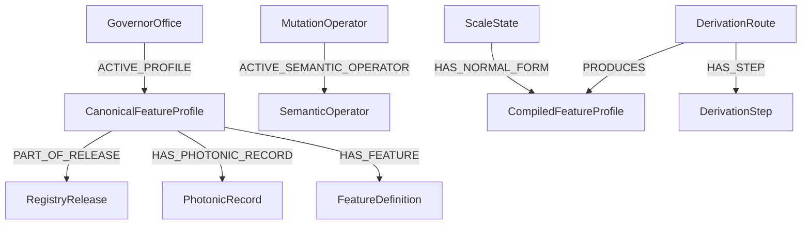

# Neo4j Installation and Graph Model

## Prerequisites

Load the universal Seven Governors topology and mutation algebra first. This
package expects existing nodes resembling:

```text
(:GovernorOffice {name})
(:ScaleState {scale_id|id, name, office, tier, forte})
(:MutationOperator {id|operator_id|operatorId})
```

The import accommodates either `scale_id` or `id`, and `id`, `operator_id`, or
`operatorId` for structural operators.

## Import order

1. Copy every file from `neo4j/csv/` to Neo4j’s import directory.
2. If v0.1.0 was previously imported, run
   `neo4j/00_v0.1.0_to_v0.1.1_migration.cypher`.
3. Run `neo4j/01_semantic_schema.cypher`.
4. Run `neo4j/02_semantic_import.cypher`.
5. Run `neo4j/03_semantic_validation.cypher`.
6. Use `neo4j/04_semantic_queries.cypher` as a query workbook.

The scripts target Neo4j 5.x and do not require APOC.

## Added node labels

| Label | Purpose |
|---|---|
| `RegistryRelease` | immutable release identity, source fingerprint, and active status |
| `CanonicalFeatureProfile` | typed canonical office profile |
| `PhotonicRecord` | measured/derived physical coordinate record |
| `FeatureDefinition` | typed feature vocabulary |
| `HarmonicMeasureDefinition` | definitions and scope for harmonic measures |
| `SemanticOperator` | semantic shell bound to a structural operator |
| `SemanticUnresolvedScope` | unanswered operator-effect category |
| `DomainProjection` | compiler contract for a domain |
| `LandformReference` | canonical landform vocabulary |
| `CompiledFeatureProfile` | destination-normalized creation packet |
| `DerivationRoute` | route history excluded from intrinsic identity |
| `DerivationStep` | one structural operation in a route |
| `ValidationFixture` | structural or normalization regression assertion; not semantic evidence by default |

## Central relationships



`HAS_CANONICAL_PROFILE` and `REALIZES` retain historical provenance.
`ACTIVE_PROFILE` and `ACTIVE_SEMANTIC_OPERATOR` select the runtime release. The
route and normal-form branches are intentionally separate. Because route,
derivation-step, and fixture IDs are logical identities rather than release
snapshots, the importer replaces their prior release/product/operator links
before attaching v0.1.1. This prevents mixed-version confluence paths.

## Validation interpretation

The first, fourth, and fifth validation queries return a `passed` boolean. The
remaining queries are violation searches and should return zero rows.

A common initial failure is an unbound semantic operator. This means the base
mutation algebra uses a different property name or was not loaded. Update only
the matching expression in `02_semantic_import.cypher`; do not create duplicate
operator identities.

## Driver use

All useful semantic values are ordinary Neo4j properties. JSON-valued fields are
stored as strings to keep the import APOC-free; parse them in the application
driver. List-valued headers are imported with `split(..., ';')`.

Use `intrinsic_fingerprint` as the cache key for generated assets. Use
`route_id` as provenance, never as the identity of the destination state.

## Driver-backed compilation

Importing the graph does not automatically make a file-backed compiler read
Neo4j. In an integrated runtime, construct `Neo4jRegistryProvider` with an open
`neo4j-driver` session and pass it to `compileProfileWithProvider`. The provider
resolves:

- the rooted `ScaleState`;
- the office’s `ACTIVE_PROFILE`;
- the active release’s photonic record and domain projection;
- each structural operator’s `ACTIVE_SEMANTIC_OPERATOR`.

The packaged file and snapshot providers remain deterministic test adapters.
Their outputs are fingerprint-equivalent to the graph provider when the graph
contains the same release.
