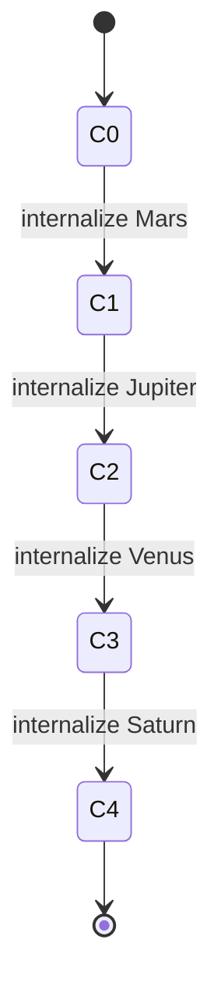

# Fivefold Engine and Thermodynamic Model

> **Status: PROPOSED — candidate extension, not admitted.**
> The Fivefold Engine and its Court coordinate are not part of the installed
> integrated release. There are no active `CourtState` nodes or
> `COURT_TRANSITION` relationships, no Court fields in `/api/creation-packet`
> responses, and no Court readiness checks. This material becomes active only
> through an explicit admission decision and a new versioned release.

## Status

The Fivefold Engine is a **framework operational state machine**. Its
thermodynamic vocabulary describes controlled movement from availability
toward commitment, embodiment, and fixation. It is not proposed as an
additional law of thermodynamics and its Court coordinate is not temperature,
entropy, enthalpy, or free energy.

This distinction lets the physical language remain illuminating without
confusing semantic organization with physical measurement.

## Architecture

The engine has three functional parts:

| Part | Members | Function |
|---|---|---|
| Macro bracket | Sun, Moon | Establish source/reality and reception/experience |
| Court poles | Mars, Jupiter, Venus, Saturn | Modulate force, direction, cohesion, and constraint |
| Controller | Mercury / Quintessence | Translate, integrate, choose transitions, and write the ledger |

Mercury is the fifth function but not a fifth binary pole. The Court state
vector is:

$$
\mathbf{c}=(m,j,v,s)\in\{0,1\}^{4},
$$

where `0 = External` and `1 = Internal`.

## Canonical Court path

| State | Vector | Internal poles | $\kappa$ | Operational reading |
|---|---:|---|---:|---|
| `C0` | `0000` | None | 0.00 | Open field; all four functions are externally available |
| `C1` | `1000` | Mars | 0.25 | Force is selected and brought into the work |
| `C2` | `1100` | Mars, Jupiter | 0.50 | Force gains direction and a bounded trajectory |
| `C3` | `1110` | Mars, Jupiter, Venus | 0.75 | The directed work acquires cohesion, fit, and internal value |
| `C4` | `1111` | All four | 1.00 | Constraint gives the selected relation durable form |

The legal forward transitions are:

Reverse transitions externalize the same pole in reverse order. Ordinary
runtime movement is adjacent. A non-adjacent jump must be expanded into
adjacent ledger events or explicitly marked as an exceptional transition.

## Court geometry

The canonical compression index is:

$$
\kappa(C_i)=\frac{i}{4}.
$$

In the paired-pole mask convention used by the framework:

$$
d_H(C_i,C_j)=2|i-j|.
$$

This is exact Court geometry, not the harmonic $C_H$ coordinate and not
thermodynamic entropy. The signed pole basis has Gram matrix $2I_4$, so each
axis is independent under the declared encoding.

The full binary field contains $2^4=16$ states. The five canonical Court
positions are a privileged monotone path through that field, not the whole
field.

## The five operational stages

The word “fivefold” also names a runtime sequence:

1. **Ledger assessment** — Mercury/Virgo reads current evidence, unresolved
   items, and prior outcomes.
2. **Bracket and target** — Sun/Moon establishes the active macro-context and
   the desired victory condition.
3. **Court compilation** — Mercury selects the current Court vector and the
   next legal pole transition.
4. **Execution and cadence** — the system renders, acts, observes, and records
   the route.
5. **Resolution and transduction** — Mercury normalizes the result, checks
   constraints, updates the ledger, and either fixes the outcome or schedules
   another adjacent transition.

These five stages can iterate while the Court itself remains bounded.

## Thermodynamic interpretation

### Two distinct uses of thermodynamic language

1. The **seven-office process ontology** describes a canonical semantic chain:
   emission, reception, activation, transduction, distribution, coupling, and
   fixation.
2. The **Fivefold Engine** uses thermodynamic ideas operationally to describe
   how a runtime moves from available possibility toward selected, coupled,
   constrained realization.

Neither layer claims that an authored artifact literally follows a measured
thermodynamic trajectory.

### State variables

The engine may record these operational variables:

| Variable | Type | Meaning | Physical quantity? |
|---|---|---|---|
| `courtState` | enum `C0..C4` | Current pole configuration | No |
| `kappaCourt` | number `[0,1]` | Court internalization coordinate | No |
| `activeBracket` | enum | Sun/Moon macro-context | No |
| `targetVictory` | office or predicate | Desired resolved condition | No |
| `availableActions` | set | Legal transitions from current state | No |
| `constraintCount` | integer | Active authored/runtime constraints | No |
| `unresolvedCount` | integer | Remaining unresolved clauses | No |
| `temperatureK` | number with unit | Optional measured/simulated temperature | Yes, only when supplied by a physical domain model |
| `entropyJPerK` | number with unit | Optional physical entropy | Yes, only when independently modeled |

Operational variables must not reuse physical units.

### Correspondence model

| Court event | Thermodynamic analogy | What the analogy contributes | What it does not assert |
|---|---|---|---|
| `C0 → C1` | activation / crossing a threshold | Energy or priority enters the process | A measured activation energy |
| `C1 → C2` | transport / directed flux | Activity acquires direction | A physical flux without units and boundary conditions |
| `C2 → C3` | coupling / affinity | Components become selectively related | Molecular bonding unless the domain model says so |
| `C3 → C4` | phase selection / fixation | Constraints stabilize a durable result | A literal phase transition |
| reverse move | release / externalization | A constraint or commitment is reopened | Entropy necessarily increases |

### Conservation and accounting

The engine's closest thermodynamic discipline is **accounting**, not an energy
law:

- every Court transition must have a cause/evidence field;
- every promoted constraint must be traceable;
- no state change occurs without a ledger delta;
- intrinsic normal form is conserved across route-equivalent derivations; and
- unresolved information cannot disappear—it must be resolved, preserved, or
  explicitly discarded with provenance.

This is an information-governance invariant, not conservation of physical
energy.

## Governor functions inside the engine

| Office | Court/controller role | Diagnostic question |
|---|---|---|
| Mars / Fire | Energy modulation | How does force enter the pattern? |
| Jupiter / Air | Direction and distribution | Where is the flow going? |
| Venus / Water | Selective cohesion | What enters meaningful relation? |
| Saturn / Earth | Constraint and durable form | What can the flow not do? |
| Mercury / Quintessence | Adaptation, translation, ledger | What transition is legal and what changed? |

Sun and Moon establish the bracket:

- Sun supplies source, actuality, or the rule being expressed.
- Moon supplies reception, lived context, or the experience in which the rule
  is encountered.

## Example: compiling an Acoustic landform

1. The topology resolves Acoustic `1749` to alternate Moon.
2. The Moon canonical profile supplies reception, reflection, and
   inward-centering priors.
3. The bracket states what source/reality is being received.
4. Court position says how much force, direction, cohesion, and constraint has
   been internalized for this particular production run.
5. Mercury compiles the packet and records any route from Lydian or
   Mixolydian.
6. The renderer creates within the packet's affordances.
7. Virgo validation checks the artifact and ledger without changing
   Acoustic's intrinsic Moon identity.

The same Acoustic normal form can be rendered at different Court positions.
Court state is runtime context, not a replacement State Governor.

## Executable requirements

`schemas/fivefold_engine.yaml` is valid only if:

- there are exactly four ordered poles;
- Mercury is identified as controller;
- the five vectors match the canonical sequence;
- each adjacent transition changes one pole;
- each pole changes once in canonical order;
- $\kappa$ values are `0`, `.25`, `.5`, `.75`, and `1`; and
- nonphysical status and unit prohibitions are present.
